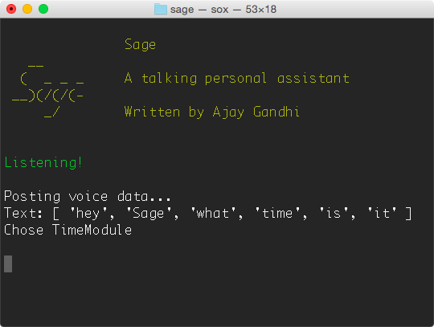

# Sage

A talking personal assistant build on Node.js

## About

Put simply, Sage is the desktop equivalent of Apple's Siri or Google Now. While
running, Sage continuously listens for you to say its hotword (default "Sage").
Then, based on a number of modules, Sage will conduct some actions and tell you
the result.

Sage is only supported for Linux and Mac, but it should run on Windows with a
few tweaks. If you happen to get it up and running, submit a pull request and
we'll add your instructions here!

## Table of Contents

- [Usage](docs/usage.md)
- [Modules](docs/module.md)
- [Installation](docs/installation.md)
- [Developing](docs/developing.md)
